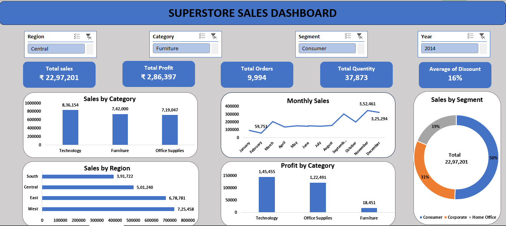

# 🛒 Superstore Sales Dashboard

An interactive **Superstore Sales Dashboard** built in **Microsoft Excel** to analyze sales performance, profit, customer segments, regional performance, and product categories using Pivot Tables, Pivot Charts, Slicers, and KPI Cards.

---

## 📌 Project Overview

This dashboard provides a comprehensive view of Superstore sales data, enabling users to monitor key business metrics and identify trends through interactive visualizations.

Users can filter the dashboard by:
- 🌍 Region
- 📦 Category
- 👥 Segment
- 📅 Year

---

## 📈 Key Performance Indicators (KPIs)

- 💰 Total Sales
- 📈 Total Profit
- 🛒 Total Orders
- 📦 Total Quantity Sold
- 🎯 Average Discount

---

## 📊 Dashboard Features

- Sales by Category
- Monthly Sales Trend
- Sales by Region
- Profit by Category
- Sales by Customer Segment
- Interactive Slicers for Dynamic Filtering

---

## 🛠️ Tools & Skills Used

- Microsoft Excel
- Pivot Tables
- Pivot Charts
- Slicers
- KPI Cards
- Data Cleaning
- Conditional Formatting
- Dashboard Design

---

## 📷 Dashboard Preview

---

## 🎯 Business Insights

- Analyze overall sales and profitability.
- Compare sales performance across regions.
- Identify top-performing product categories.
- Track monthly sales trends.
- Evaluate customer segment contribution.
- Support business decisions with interactive data visualization.

---

## 👨‍💻 Author

**Sachin Salahalli**

Aspiring Data Analyst | Excel | SQL | Power BI
